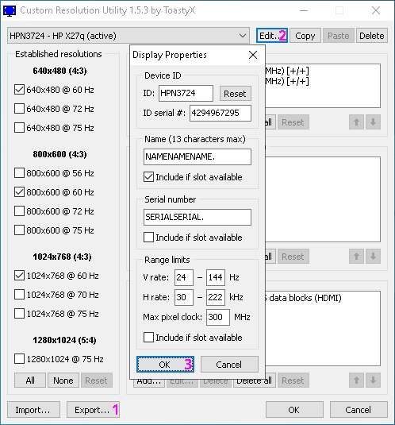

# Nika Read Only: Apex Legends External Cheat for Linux

- Say `No!` to officially endorsed cheating.
  - Say `No!` to controller aim assist.

This guide provides step-by-step instructions for SGPU/Single GPU Users for setting up an external cheat for Apex Legends on a Linux system.

> **Note**: This guide is an experimental guide meaning nothing has been tested as I am unavaliable to test it, but since nothing major was changed it should be fine (I hope).

## Overview

Nika Read Only is an external cheat for Apex Legends, designed to run on a Linux host with a Windows virtual machine (VM) via QEMU/KVM. The setup allows the cheat to work alongside the game for enhanced gameplay features.

```shell
+----------+    +----------+    +------------+    +--------------+
| Linux PC | -> | QEMU/KVM | -> | Windows VM | -> | Apex Legends |
+----------+    +----------+    +------------+    +--------------+
```

## Features

- [x] Stable CR3 shuffle for Windows 10 20H1

- [x] Overlay-based ESP for players and items

- [x] Cycle through LIGHT / ENERGY / SHOTGUN / HEAVY / SNIPER / GEAR items using keys `5` / `6` / `7` / `8` / `9` / `0`

- [x] Map radar

- [x] Spectators list

- [x] Humanized aimbot

- [x] Aimbot for **skynade** (works behind cover) when holding RMB inside FOV circle

- [x] **Lock on target** and **triggerbot** auto-fire when holding SHIFT

- [x] Toggle **aimbot strength** with CURSOR_LEFT (`<` symbol in top-left corner)

- [x] Toggle **ADS locking** with CURSOR_RIGHT (`>` symbol in top-left corner)

- [x] Enable/disable **triggerbot** auto-fire with CURSOR_UP (`^` symbol in top-left corner)

- [x] Toggle hitbox (`body`/`neck`/`head`) with CURSOR_DOWN (displayed in top-left corner)

- [ ] **Superglide** by holding CAPS_LOCK (not implemented)

- [x] Press `F8` to dump **r5apex** and scan for offsets

- [x] Press `F9` twice to terminate the cheat

- [ ] **In-game bindings**:

  - Bind `X` to fire (used by triggerbot as `AIMBOT_FIRING_KEY`)
  - Unbind LMB from fire (`AIMBOT_ACTIVATED_BY_MOUSE` default: YES)

## Prerequisites

This guide was was meant for 42 KDE but is an experimental guide due to me not having a way to actually test it. For distro-specific issues, consult documentation or use tools like ChatGPT to adapt commands.

- **Download Fedora 41 KDE or Fedora 42 KDE**: [Fedora KDE 41](https://fedora.mirrorservice.org/fedora/linux/releases/41/Spins/x86_64/iso/Fedora-KDE-Live-x86_64-41-1.4.iso) or [Fedora KDE 42](https://download.fedoraproject.org/pub/fedora/linux/releases/42/KDE/x86_64/iso/Fedora-KDE-Desktop-Live-42-1.1.x86_64.iso)
- Ensure your system has a password set for use with PuTTY later on.

## Setup Instructions

### 1. Enable Virtualization in BIOS

1. Enter your BIOS and enable:
   - **Intel**: VT-d (VMX) and IOMMU
   - **AMD**: AMD-Vi (SVM) and IOMMU
1.1. Disable "Above 4G Decoding".

1.2 Once fully loaded into the vm:
- Update your OS: `sudo dnf update` and reboot. -- optional step
- Install NVIDIA drivers (I am usnure about AMD GPUs command): `sudo dnf install akmod-nvidia xorg-x11-drv-nvidia-cuda` -- optional step
- Install virtualization tools: `sudo dnf group install --with-optional virtualization`

### 2. Configure Bootloader

1. Edit GRUB configuration:

   ```shell
   sudo vi /etc/default/grub
   ```
2. Press `A` to edit, and append to `GRUB_CMDLINE_LINUX_DEFAULT` (replace `intel_iommu=on` with `amd_iommu=on` for AMD CPUs):

   ```shell
   resume=/dev/mapper/fedora_localhost--live-swap rd.lvm.lv=fedora_localhost-live/root rd.lvm.lv=fedora_localhost-live/swap intel_iommu=on quiet
   ```
3. Save and exit (`Esc`, then `:wq`).
4. Update GRUB: `sudo grub2-mkconfig -o /etc/grub2.cfg`

### 3. Configure Libvirt

1. Edit `/etc/libvirt/libvirtd.conf` (use `sudo vi` or `kwrite`):

   - Uncomment and set: `user = "1000"`
   - Uncomment: `unix_sock_group = "libvirt"` and `unix_sock_rw_perms = "0770"` (lines 80–105)
   - Append:

     ```shell
     log_filters="3:qemu 1:libvirt"
     log_outputs="2:file:/var/log/libvirt/libvirtd.log"
     ```

2. Add user to groups: `sudo usermod -a -G kvm,libvirt $(whoami)`

3. Enable and start libvirtd:

   ```shell
   sudo systemctl enable libvirtd
   sudo systemctl start libvirtd
   ```

4. Verify group membership: `sudo groups $(whoami)`

   - Example:

     

5. Edit `/etc/libvirt/qemu.conf`:

   - Uncomment and replace `user = "root"` and `group = "root"` with your username (e.g., `user = "yourusername"`).
   - Example:

     

6. Restart libvirtd: `sudo systemctl restart libvirtd`

7. - Virtual Machine Manager >> Edit >> Preferences >> General >> _check_ [x] Enable XML editing >> [Close]
- Virtual Machine Manager >> Edit >> Preferences >> New VM >> Storage format: Raw >> [Close]

8. Install `sudo dnf install macchanger`

9. - Manually start `default virtual network` every reboot:
```shell
sudo virsh net-autostart default --disable
sudo virsh net-start default
sudo macchanger --mac=XX:XX:XX:XX:XX:XX virbr0
```

### 4. Set Up Virtual Machine

- Open Virtual Machine Manager >> File >> New Virtual Machine

- Local install media **ISO image or CDROM** >> `Windows10.iso` >> Choose Memory and CPU settings >> _uncheck_ [ ] Enable storage for this virtual machine >> _check_ [x] Customize configuration before install >> [Finish]
  - Overview >> Chipset: Q35, **Firmware**: OVMF_CODE_4M.secboot or UEFI >> [Apply]
  - [Add Hardware] >> Storage >> Device type: Disk device >> Bus type: SATA >> Create a disk image for the virtual machine: 240 GiB >> Advanced options >> Serial: B4NN3D53R14L >> [Finish]
  - [Begin Installation] >> Virtual Machine >> Shut Down >> Force Off
 
- [Add Hardware] >> TPM >> Type: Emulated >> Model: CRB >> Version: 2.0 >> [Finish]

- Virtual Machine Manager >> [Open] >> View >> Details >> Video QXL >> Model: VGA >> [Apply]

- Virtual Machine Manager >> [Open] >> View >> Details >> NIC :xx:xx:xx >> XML


- Replace `<mac address="52:54:00:xx:xx:xx"/>` and [Apply]:
  <details>
    <summary>Spoiler</summary>

  ```shell
  <mac address="xx:xx:xx:xx:xx:xx"/>
  ```
  </details>

- Virtual Machine Manager >> [Open] >> View >> Details >> SATA Disk 1 >> XML


- Replace `<driver name="qemu" type="raw"/>` and [Apply]:
  <details>
    <summary>Spoiler</summary>

  ```shell
  <driver name="qemu" type="raw" cache="none" discard="ignore"/>
  ```
  </details>

### 5. Configure VM XML

- Virtual Machine Manager >> [Open] >> View >> Details >> Overview >> XML


- Replace `<domain type="kvm">` and [Apply]:
  <details>
    <summary>Spoiler <b>(do NOT use this example, instead modify it with your own SMBIOS data; sudo dmidecode)</b></summary>

  ```shell
  <domain type="kvm" xmlns:qemu="http://libvirt.org/schemas/domain/qemu/1.0">
    <qemu:commandline>
      <qemu:arg value="-smbios"/>
      <qemu:arg value="type=1,manufacturer=HP,product=HP Laptop 14s-dq2xxx,version=23.41,serial=D3E4F56789"/>
      <qemu:arg value="-smbios"/>
      <qemu:arg value="type=2,manufacturer=HP,product=87FD,version=34.12,serial=B1C2D3E4F56789"/>
      <qemu:arg value="-smbios"/>
      <qemu:arg value="type=3,manufacturer=HP,version=23.41,serial=D3E4F56789"/>
      <qemu:arg value="-smbios"/>
      <qemu:arg value="type=4,sock_pfx=U3E1,manufacturer=Intel(R) Corporation,version=11th Gen Intel(R) Core(TM) i5-1135G7 @ 2.40GHz,processor-id=0xBFEBFBFF000806C1"/>
      <qemu:arg value="-smbios"/>
      <qemu:arg value="type=17,manufacturer=Samsung,part=M471A5244CB0-CWE,speed=3200,serial=D3E4F5"/>
      <qemu:arg value="-smbios"/>
      <qemu:arg value="type=8,internal_reference=J1A1,external_reference=Keyboard,connector_type=0x0F,port_type=0x0D"/>
      <qemu:arg value="-smbios"/>
      <qemu:arg value="type=8,internal_reference=J1A1,external_reference=Mouse,connector_type=0x0F,port_type=0x0E"/>
      <qemu:arg value="-smbios"/>
      <qemu:arg value="type=9,slot_designation=J6C1,slot_type=0xAA,slot_data_bus_width=0x0D,current_usage=0x04,slot_length=0x04,slot_id=0x01,slot_characteristics1=0x04,slot_characteristics2=0x03"/>
    </qemu:commandline>
  ```
  </details>

  - VM created by QEMU is Intel, do not use AMD data.


- Replace `</metadata>` and [Apply]:
  <details>
    <summary>Spoiler</summary>

  ```shell
    <vmware xmlns="http://www.vmware.com/schema/vmware.config">
      <config>
        <entry name="hypervisor.cpuid.v0" value="FALSE"/>
      </config>
    </vmware>
  </metadata>
  ```
  </details>


- Replace from `<memory unit="KiB">4194304</memory>` to `<vcpu placement="static">2</vcpu>` and [Apply]:
  <details>
    <summary>Spoiler <b>(use a commercial memory size like 8, 16, or 24 GiB; vcpu example for 8 threads host CPU)</b></summary>

  ```shell
  <memory unit="GiB">24</memory>
  <currentMemory unit="GiB">24</currentMemory>
  <vcpu placement="static">8</vcpu>
  ```
  </details>


- Replace from `<features>` to `</clock>` and [Apply]:
  <details>
    <summary>Spoiler (example for 4 cores 8 threads host CPU)</summary>

  ```shell
  <features>
    <acpi/>
    <apic/>
    <hyperv mode="custom">
      <relaxed state="off"/>
      <vapic state="off"/>
      <spinlocks state="off"/>
      <vpindex state="off"/>
      <runtime state="off"/>
      <synic state="off"/>
      <stimer state="off"/>
      <reset state="off"/>
      <vendor_id state="off"/>
      <frequencies state="off"/>
      <reenlightenment state="off"/>
      <tlbflush state="off"/>
      <ipi state="off"/>
      <evmcs state="off"/>
      <avic state="off"/>
    </hyperv>
    <kvm>
      <hidden state="on"/>
    </kvm>
    <pmu state="on"/>
    <vmport state="off"/>
    <smm state="on"/>
    <ioapic driver="kvm"/>
    <msrs unknown="fault"/>
  </features>
  <cpu mode="host-passthrough" check="none" migratable="off">
    <topology sockets="1" cores="4" threads="2"/>
    <feature policy="disable" name="hypervisor"/>
    <feature policy="require" name="svm"/>
    <feature policy="require" name="vmx"/>
    <feature policy="disable" name="x2apic"/>
    <feature policy="require" name="topoext"/>
  </cpu>
  <clock offset="localtime">
    <timer name="tsc" present="yes" tickpolicy="discard" mode="native"/>
    <timer name="hpet" present="yes"/>
    <timer name="rtc" present="no"/>
    <timer name="pit" present="no"/>
    <timer name="kvmclock" present="no"/>
    <timer name="hypervclock" present="no"/>
  </clock>
  ```
  </details>


- Replace from `<memballoon model="virtio">` to `</memballoon>` and [Apply]:
  <details>
    <summary>Spoiler</summary>

  ```shell
  <memballoon model="none"/>
  ```
  </details>


- Replace `<audio id="1" type="spice"/>` and [Apply]:
  <details>
    <summary>Spoiler <b>(for pipewire sound, not required)</b></summary>

  ```shell
  <audio id="1" type="pipewire" runtimeDir="/run/user/1000">
    <input name="qemuinput"/>
    <output name="qemuoutput"/>
  </audio>
  ```
  </details>

- Virtual Machine Manager >> [Open] >> View >> Details >> Tablet >> [Remove]

- Virtual Machine Manager >> [Open] >> View >> Details >> Serial 1 >> [Remove]

- Virtual Machine Manager >> [Open] >> View >> Details >> Channel (spice) >> [Remove]

- Virtual Machine Manager >> [Open] >> View >> Details >> Controller VirtIO Serial 0 >> [Remove]

### 6. Configure Windows VM Boot

1. In **Virtual Machine Manager** &gt; Boot Options, set **SATA Disk 1** as the first boot device. Apply.

### 7. Install VFIO Scripts

1. Clone the repository: `git clone https://gitlab.com/risingprismtv/single-gpu-passthrough.git`

2. Navigate to the folder and run:

   ```shell
   sudo chmod +x install_hooks.sh
   sudo ./install_hooks.sh
   ```

3. Verify files:

   - `/etc/systemd/system/libvirt-nosleep@.service`
   - `/usr/local/bin/vfio-startup` and `vfio-teardown`
   - `/etc/libvirt/hooks/qemu`

4. **AMD GPU Fix (if needed)**:

   - Remove the above files.
   - Clone: `git clone https://gitlab.com/akshaycodes/vfio-script`
   - Run: `sudo bash vfio_script_install.sh`

### 8. Attach GPU to VM

1. Remove **Display spice** and **Video QXL** from VM settings.
2. Identify GPU devices:

   ```shell
   #!/bin/bash
   shopt -s nullglob
   for g in /sys/kernel/iommu_groups/*; do
       echo "IOMMU Group ${g##*/}:"
       for d in $g/devices/*; do
           echo -e "\t$(lspci -nns ${d##*/})"
       done;
   done;
   ```
   - Example:

     
   - Add GPU devices (e.g., `07:00.0` and `07:00.1`, exclude bridges) via **Add Hardware &gt; PCI Host Device**.

### 9. Configure Evdev Passthrough

1. Identify mouse and keyboard:

   ```shell
   ls -l /dev/input/by-id/
   ```
   - Example output:

     ```shell
     usb-COMPANY_USB_Device-event-if02 -> ../event7
     usb-COMPANY_USB_Device-event-kbd -> ../event4
     usb-COMPANY_USB_Device-if01-event-mouse -> ../event5
     usb-COMPANY_USB_Device-if01-mouse -> ../mouse0
     usb-COMPANY_USB_Device-if02-event-kbd -> ../event6
     usb-SONiX_USB_DEVICE-event-if01 -> ../event9
     usb-SONiX_USB_DEVICE-event-kbd -> ../event8
     ```
   - Mouse: `usb-COMPANY_USB_Device-if01-event-mouse -> ../event5`
   - Keyboard: `usb-SONiX_USB_DEVICE-event-kbd -> ../event8`
2. Edit `/etc/libvirt/qemu.conf` and uncomment:

```shell
cgroup_device_acl = [
        "/dev/null", "/dev/full", "/dev/zero",
        "/dev/random", "/dev/urandom",
        "/dev/ptmx", "/dev/kvm", "/dev/kqemu",
        "/dev/rtc", "/dev/hpet",
        "/dev/input/by-id/usb-COMPANY_USB_Device-if01-event-mouse",
        "/dev/input/by-id/usb-SONiX_USB_DEVICE-event-kbd",
        "/dev/input/event5",
        "/dev/input/event8",
        "/dev/userfaultfd"
]
```
- Include `cgroup_device_acl` as above, replacing `event-kbd`, `event-mouse`, and the path to each symlink `/dev/input/eventX`.


3. Restart libvirtd: `sudo systemctl restart libvirtd`
4. Add evdev to VM XML:

   ```shell
   <qemu:arg value="-object"/>
   <qemu:arg value="input-linux,id=kbd1,evdev=/dev/input/by-id/usb-SONiX_USB_DEVICE-event-kbd,grab_all=on,repeat=on"/>
   <qemu:arg value="-object"/>
   <qemu:arg value="input-linux,id=mouse1,evdev=/dev/input/by-id/usb-COMPANY_USB_Device-if01-event-mouse"/>
   ```
5. Join input group:
 ```shell
test $UID = 0 && exit
sudo usermod -aG input $USER
```
6. Toggle input with `LEFT_CTRL + RIGHT_CTRL`.

### 10. Disable Security Features

- **Fedora**: Disable SELinux each reboot: `sudo setenforce 0`
- **Debian**: Permanently disable AppArmor:

  ```shell
  sudo systemctl stop apparmor
  sudo systemctl disable apparmor
  ```

### 11. Spoof qemu (Mandatory)

- This script is based on: [Scrut1ny/Hypervisor-Phantom](https://github.com/Scrut1ny/Hypervisor-Phantom)


  <details>
    <summary>Build on <b>Fedora Linux</b>:</summary>

  ```shell
  sudo dnf builddep qemu
  sudo dnf install acpica-tools
  ```
  </details>


  <details>
    <summary>Build on <b>Debian Linux</b>:</summary>

  ```shell
  sudo apt build-dep qemu
  sudo apt install acpica-tools
  ```
  </details>

- Run `qemupatch.sh` to clone, patch, and build QEMU with generated data.

- Virtual Machine Manager >> [Open] >> View >> Details >> Overview >> XML


- Replace from `<pm>` to `</emulator>` and [Apply]:
  <details>
    <summary>Spoiler</summary>

  ```shell
  <pm>
    <suspend-to-mem enabled="yes"/>
    <suspend-to-disk enabled="no"/>
  </pm>
  <devices>
    <emulator>/usr/local/bin/qemu-system-x86_64</emulator>
  ```
  </details>


- Replace `</qemu:commandline>` and [Apply]:
  <details>
    <summary>Spoiler <b>(not required, ignore this)</b></summary>

  ```shell
    <qemu:arg value="-acpitable"/>
    <qemu:arg value="file=/usr/local/bin/ssdt1.aml"/>
  </qemu:commandline>
  ```
  </details>
  
### 12. Spoof OVMF (Mandatory)

- This script is based on: [Scrut1ny/Hypervisor-Phantom](https://github.com/Scrut1ny/Hypervisor-Phantom)


  <details>
    <summary>Build on <b>Fedora Linux</b>:</summary>

  ```shell
  sudo dnf install g++
  sudo dnf install nasm
  sudo dnf install python3-virt-firmware
  ```
  </details>


  <details>
    <summary>Build on <b>Debian Linux</b>:</summary>

  ```shell
  sudo apt install g++
  sudo apt install nasm
  sudo apt install python3-virt-firmware
  ```
  </details>

- Run `edk2patch.sh` to clone, patch, and build OVMF with generated data.

- Virtual Machine Manager >> [Open] >> View >> Details >> Overview >> XML


- Replace from `<os firmware="efi">` to `</os>` and [Apply]:
  <details>
    <summary>Spoiler</summary>

  ```shell
  <os>
    <type arch="x86_64" machine="pc-q35-9.2">hvm</type>
    <loader readonly="yes" secure="yes" type="pflash" format="qcow2">/usr/share/edk2/ovmf/OVMF_CODE_4M.patched.qcow2</loader>
    <nvram format="qcow2">/usr/share/edk2/ovmf/OVMF_VARS_4M.patched.qcow2</nvram>
    <bootmenu enable="yes"/>
  </os>
  ```
  </details>

### 13. Spoof EDID (Unsure the importance of this step, but it may be fine to skip over)

- Pinnacle of HWID ban (EAC case).

| Ban # | Public IP | Router MAC | Monitor 1 | Monitor 2 |
| ----- | --------- | ---------- | --------- | --------- |
| 1     | Flagged   | Flagged    | Flagged   |           |
| 2     | Flagged   | Flagged    | Banned    |           |
| 3     | Flagged   | Flagged    |           | Flagged   |
| 4     | Flagged   | Banned     |           | Banned    |

- Download CRU from: [`CRU thread`](https://www.monitortests.com/forum/Thread-Custom-Resolution-Utility-CRU).

- Backup original EDID (1).

- Modify current EDID (2).

- Apply modified EDID (3).

- Save modified EDID (1).



- Download EDWriter from: [`EDWriter thread`](https://www.monitortests.com/forum/Thread-EDID-DisplayID-Writer).

- Write modified EDID.

| Capture Card               | Dummy Plug        |
| -------------------------- | ----------------- |
| Game Capture HD60 S+       | [`Fueran HDMI-2K-3P`](https://www.amazon.com/dp/B06XSY9THQ/) (NA) |
| Game Capture HD60 X        | [`Fueran HDMI-2K-3P`](https://www.amazon.de/dp/B06XSY9THQ/) (EU) |
| Game Capture 4K60 Pro      |                   |
| Game Capture 4K60 Pro MK.2 |                   |
| Game Capture 4K60 S+       |                   |
| Game Capture 4K X          |                   |
| Game Capture 4K Pro        |                   |

### 14 Spoof GPU (tested from 51x to 57x)

- Disable ROM BAR for each PCI Host Device:
  - Virtual Machine Manager >> [Open] >> View >> Details >> PCI 0000:xx:xx.x >> ROM BAR: [ ] _uncheck_ >> [Apply]

- Check old UUID with `nvidia-smi -L`.
- Run the cheat BEFORE the game at least once.
- Check new UUID with `nvidia-smi -L`.


### Spoof network (not required, ignore this)

- This step is a journey on it's own. Initially you should skip it, but return later when you feel prepared.

- You should set another router between your machine and your ISP router.

- Most routers allow you to change (clone) WAN and WLAN network identifier (MAC address), yet what you need to periodically change is LAN network identifier, because that is what will be in your ARP table (arp -a) and what is collected for identification.

- Educate yourself about [DD-WRT](https://dd-wrt.com/) or [OpenWRT](https://openwrt.org/), and then shop locally for a compatible router:
  - **Shop locally** as you will be looking at the product tag for **brand**, **model**, and specially **version**.
  - Updating will be as simple as selecting **factory-to-ddwrt.bin** file in your router update page, for that specific brand+model+version.

- For DD-WRT go to: Administration >> Management >> Remote Access >> Telnet Management >> _check_ [x] Enable >> [Save] >> [Reboot Router]

- Telnet to your router, authenticate and enter:
```shell
nvram set lan_hwaddr=XX:XX:XX:XX:XX:XX (set LAN new MAC address)
nvram get lan_hwaddr
nvram commit
reboot
```

- For DD-WRT go to: Setup >> MAC Address Clone >> _check_ [x] Enable >> [Save]
  - Clone WAN MAC (set WAN new MAC address)
  - Clone Wireless MAC (set Wireless new MAC address)
  - [Save]

- For DD-WRT go to: Administration >> Management >> [Reboot Router]

### 15. Configure Nika

1. Edit `Nika.ini` and set `START_OVERLAY = NO`.

### 16. Usage

- For **window settings**, open; System Settings >> Window Management >> Window Rules >> Import... >> GLFW.kwinrule
  - Also check; System Settings >> Display & Monitor >> Scale: 100%

- Virtual Machine Manager >> [Open] >> View >> Details >> Video VGA >> Model: None >> [Apply]

- You will be using video output from passthrough GPU instead of VGA virtual GPU.

| Method                       | Latency   | ESP          | Cons                         |
| ---------------------------- | --------- | ------------ | ---------------------------- |
| Cable                        | 0 ms      | Glow         | Overlay on 2nd monitor       |
| Capture card                 | 30-300 ms | Overlay+Glow | Investment for faster device |
| Steam Remote Play            | 10 ms     | Overlay+Glow | Encoded video                |

### 16.1 Cable

- Plug monitor into passthrough GPU.

### 16.2 Capture card


  <details>
    <summary>Install `gstreamer1.0-tools` on <b>Debian Linux</b>:</summary>

    sudo apt install gstreamer1.0-tools
  </details>

- Plug capture card into passthrough GPU.

- Open capture card raw feed with:
```shell
gst-launch-1.0 -v v4l2src device=/dev/video0 ! video/x-raw,width=1920,height=1080,framerate=60/1 ! videoconvert ! autovideosink
```

### 16.3 Steam Remote Play (if you can't connect)

- Virtual Machine Manager >> [Open] >> View >> Details >> NIC xx:xx:xx >> Network source: Bridge device... >> Device name: br0 >> [Apply]

- Find your active network interface with:
```shell
ip -br addr show

lo               UNKNOWN        127.0.0.1/8
eno1             DOWN           
wlp10s0f3u1      UP             172.16.0.100/24
```

- Manually configure `br0` every reboot:
```shell
sudo ip link add name br0 type bridge
sudo ip addr add 10.0.0.1/24 dev br0
sudo ip link set dev br0 up
sudo sysctl -w net.ipv4.ip_forward=1
sudo iptables --table nat --append POSTROUTING --out-interface wlp10s0f3u1 -j MASQUERADE
sudo iptables --insert FORWARD --in-interface br0 -j ACCEPT
```

- Windows VM static configuration (TCP/IPv4):
  - IP address: 10.0.0.100
  - Subnet mask: 255.255.255.0
  - Default gateway: 10.0.0.1
  - Preferred DNS server: 8.8.8.8
  - Alternate DNS server: 9.9.9.9

## Troubleshooting

- If KVM is not detected, add `ibt=off` (or `no_cet`) to GRUB: `sudo vi /etc/default/grub`, then `sudo grub2-mkconfig -o /etc/grub2.cfg`.
- I don't believe ```15. Usage``` working without the overlay being enabled.

- Logs for troubleshooting
```
win10.log        => /var/log/libvirt/qemu
custom_hooks.log => /var/log/libvirt/
libvirtd.log     => /var/log/libvirt/
```

